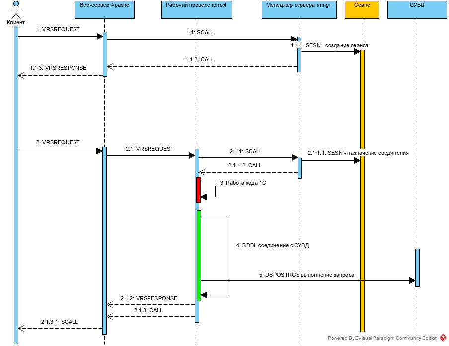
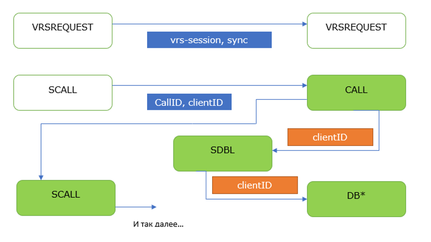

## Серверный вызов и события технологического журнала

Путешествие серверного вызова с клиента до СУБД можно представить схемой:

Взаимосвязь событий технологического журнала через их свойства можно представить схемой:

